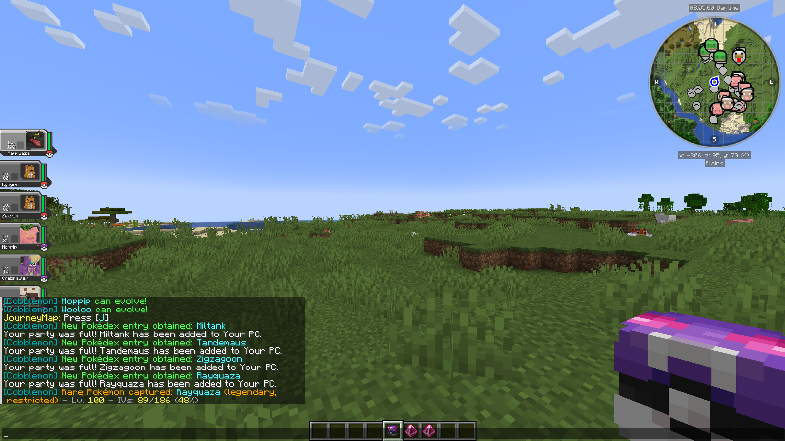
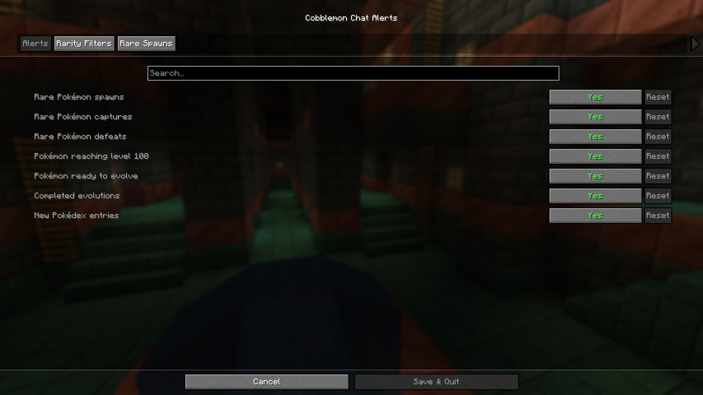
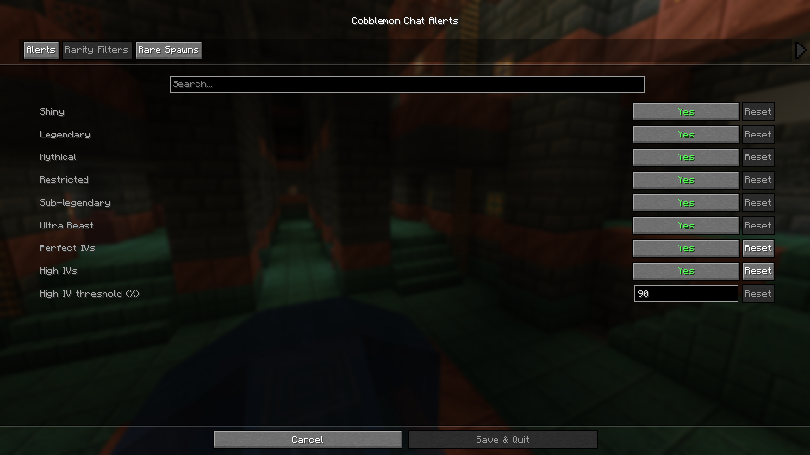
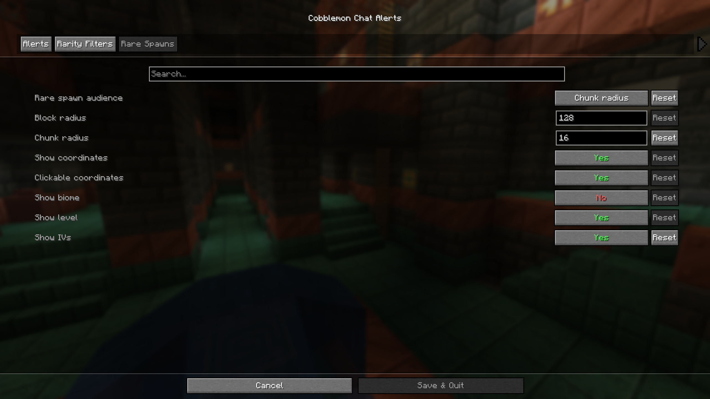

# Cobblemon Chat Alerts

Fabric 1.21.1 companion mod for Cobblemon that adds configurable chat notifications for important Pokemon events.

This is an unofficial companion mod and is not affiliated with Cobblemon's developers.

## Status

- Latest release: `0.1.2+mc1.21.1-fabric`
- GitHub release: [v0.1.2](https://github.com/alexandre-hemery/cobblemon-chat-alerts/releases/tag/v0.1.2)
- Modrinth: submitted for review on 2026-07-08.
- Issue tracker: [GitHub Issues](https://github.com/alexandre-hemery/cobblemon-chat-alerts/issues)

## Features

- Rare wild Pokemon spawn alerts.
- Rare Pokemon capture and defeat alerts.
- Level 100, evolution-ready, evolution-complete, and Pokedex-entry alerts.
- Separate rarity filters for shiny, legendary, mythical, restricted, sub-legendary, Ultra Beast, perfect IVs, and high IVs.
- Configurable rare-spawn range: block radius, chunk radius, or whole dimension.
- Optional clickable coordinates, biome, level, and IV details.
- English and French localization.
- JSON config file plus Mod Menu support through Cloth Config.

## Screenshots

These screenshots show the current 0.1.2 UI in English.

<table>
  <tr>
    <td width="50%">
      
      <br>
      <sub>Chat alerts in game.</sub>
    </td>
    <td width="50%">
      
      <br>
      <sub>Alert toggles in Mod Menu.</sub>
    </td>
  </tr>
  <tr>
    <td width="50%">
      
      <br>
      <sub>Rarity and IV filters.</sub>
    </td>
    <td width="50%">
      
      <br>
      <sub>Range and spawn detail settings.</sub>
    </td>
  </tr>
</table>

## Requirements

- Minecraft 1.21.1
- Fabric Loader
- Fabric API
- Cobblemon 1.7.3 for Fabric
- Cloth Config
- Mod Menu is optional, but recommended for in-game configuration.

## Installation

Download the Fabric jar from the latest GitHub release, then place it in the `mods` folder with the required dependencies.

For multiplayer servers, install the mod on the server so it can detect Cobblemon events and send chat alerts. Client installation is optional for receiving chat alerts, but useful for singleplayer worlds and for the Mod Menu configuration screen.

## Configuration

The config file is created at:

```text
config/cobblemon-chat-alerts.json
```

If Mod Menu and Cloth Config are installed, the settings can also be edited in game from Mod Menu.

## Build

```bash
./gradlew build
```

The built jar is created in:

```text
build/libs/
```

## Notes

- Alerts are chat-only for now.
- Whole-world rare-spawn alerts currently mean all players in the same dimension as the spawn.
- IV-based rarity filters are disabled by default.
- Pokemon names use Cobblemon's translated components, so they follow the player's Minecraft language when translations exist.

## License

This project is licensed under the MIT License.
